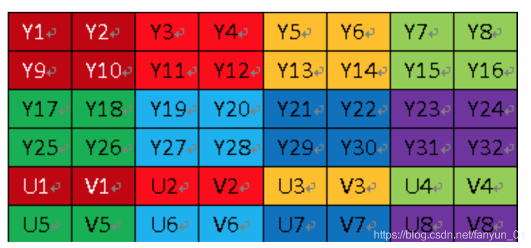
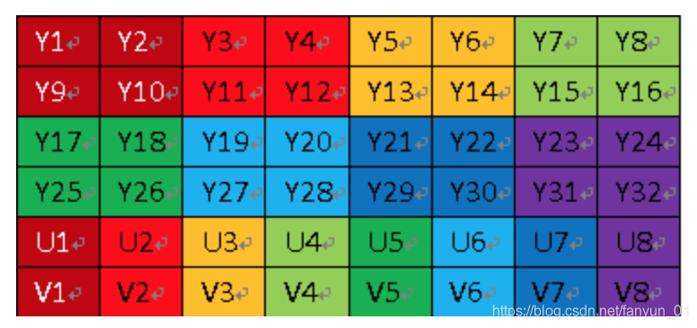

# 概要
- 视频相关 DMEO

## YUV 
#### 1、简介
- YUV，分为三个分量，“Y”表示明亮度（Luminance或Luma），也就是灰度值；而“U”和“V” 表示的则是色度（Chrominance或Chroma），作用是描述影像色彩及饱和度，用于指定像素的颜色。
- 与我们熟知的RGB类似，YUV也是一种颜色编码方法，主要用于电视系统以及模拟视频领域，它将亮度信息（Y）与色彩信息（UV）分离，没有UV信息一样可以显示完整的图像，只不过是黑白的，这样的设计很好地解决了彩色电视机与黑白电视的兼容问题。并且，YUV不像RGB那样要求三个独立的视频信号同时传输，所以用YUV方式传送占用极少的频宽。
#### 2、YUV存储格式
-   YUV码流的存储格式其实与其采样的方式密切相关，主流的采样方式有三种，YUV4:4:4，YUV4:2:2，YUV4:2:0，关于其详细原理，可以通过网上其它文章了解，这里我想强调的是如何根据其采样格式来从码流中还原每个像素点的YUV值，因为只有正确地还原了每个像素点的YUV值，才能通过YUV与RGB的转换公式提取出每个像素点的RGB值，然后显示出来。
- 先记住下面这段话，以后提取每个像素的YUV分量会用到。
	1. YUV 4:4:4采样，每一个Y对应一组UV分量8+8+8 = 24bits,3个字节。
	2. YUV 4:2:2采样，每两个Y共用一组UV分量,一个YUV占8+4+4 = 16bits 2个字节。
	3. YUV 4:2:0采样，每四个Y共用一组UV分量一个YUV占8+2+2 = 12bits  1.5个字节。
#### 3、YUV420类型
- **3.1、YUV420p和YUV420sp区别**
- 因为YUV420比较常用， 在这里就重点介绍YUV420。YUV420分为两种：**YUV420p**和**YUV420sp**。
- YUV420sp格式如下图：

- YUV420p格式如下图：


- **3.2、YUV420p和YUV420sp具体分类和详情**
```
YUV420p：又叫planer平面模式，Y ，U，V分别再不同平面，也就是有三个平面。

YUV420p又分为：他们的区别只是存储UV的顺序不一样而已。

I420:又叫YU12，安卓的模式。存储顺序是先存Y，再存U，最后存V。YYYYUUUVVV

YV12:存储顺序是先存Y，再存V，最后存U。YYYVVVUUU

YUV420sp：又叫bi-planer或two-planer双平面，Y一个平面，UV在同一个平面交叉存储。

YUV420sp又分为：他们的区别只是存储UV的顺序不一样而已。

NV12:IOS只有这一种模式。存储顺序是先存Y，再UV交替存储。YYYYUVUVUV

NV21:安卓的模式。存储顺序是先存Y，再存U，再VU交替存储。YYYYVUVUVU
```
- **3.3、YUV420的内存计算**

	1. width * hight =Y（总和）
	2. U = Y / 4   V = Y / 4
	3. 所以YUV420 数据在内存中的长度是 width * hight * 3 / 2（即一个YUV是1.5个字节），所以计算采集的数据大小：width * hight * 1.5*frame*time
	4.以720×488大小图象YUV420 planar为例
```
其存储格式是： 共大小为720×480×3 × 1.5字节，

分为三个部分:Y,U和V

Y分量：    (720×480)个字节

U(Cb)分量：(720×480 × 1/4)个字节

V(Cr)分量：(720×480 × 1/4)个字节

三个部分内部均是行优先存储，三个部分之间是Y,U,V 顺序存储。

即YUV数据的0－－720×480字节是Y分量值，

720×480－－720×480×5/4字节是U分量

720×480×5/4 －－720×480×3/2字节是V分量。

一般来说，直接采集到的视频数据是RGB24的格式，RGB24一帧的大小size＝width×heigth×3 Bit，RGB32的size＝width×heigth×4，YUV标准格式4：2：0 的数据量是 size＝width×heigth×1.5 Bit。

在采集到RGB24数据后，需要对这个格式的数据进行第一次压缩。即将图像的颜色空间由RGB2YUV。因为，X264在进行编码的时候需要标准的YUV（4：2：0）。

经过第一次数据压缩后RGB24－>YUV（I420）。这样，数据量将减少一半，经过X264编码后，数据量将大大减少。将编码后的数据打包，通过RTP实时传送。到达目的地后，将数据取出，进行解码。完成解码后，数据仍然是YUV格式的，所以，还需要一次转换，就是YUV2RGB24。
```
- 详细可见  图解YU12、I420、YV12、NV12、NV21、YUV420P、YUV420SP、YUV422P、YUV444P的区别_handy周-CSDN博客 [https://blog.csdn.net/byhook/article/details/84037338]( https://blog.csdn.net/byhook/article/details/84037338)

- 生产yuv图片
```shell
	ffmpeg -i 1920_1080.jpg -s 1920x1080 -pix_fmt nv12 YUV420SP_1920_1080_NV12_img.yuv
```

## ssd2x2_yuv_play_test1
- 显示yuv图片到panel
- 支持1280*720以下
- 212 YUV420 只支持 SP，NV12（E_MI_SYS_PIXEL_FRAME_YUV_SEMIPLANAR_420） 或 NV21（E_MI_SYS_PIXEL_FRAME_YUV_SEMIPLANAR_420_NV21）
- 原厂yuv图片显示DMEO
```
	./YuvToPanel yuv_filename dispinwidth dispinheight dispoutwidth dispoutheight
	eg:./ssd2x2_yuv_play_test1 ./res/YUV420SP_1024_600_img.yuv 1024 600 1024 600
```

## ssd2x2_yuv_play_test1
- 显示yuv视频，默认输出800*480到panel
- 支持1280*720以下
- 212 YUV420 只支持 SP，NV12（E_MI_SYS_PIXEL_FRAME_YUV_SEMIPLANAR_420） 或 NV21（E_MI_SYS_PIXEL_FRAME_YUV_SEMIPLANAR_420_NV21）
- 原厂yuv图片显示DMEO
```
	./ssd2x2_yuv_play_test2 yuv_filename dispinwidth dispinheight
	eg:./ssd2x2_yuv_play_test2 res/YUV420SP_1280_720_NV12_video.yuv 1280 720
```


## ssd20x_h264_play_test1
- 原厂demo，默认点公板屏，可播放h264/h265视频
```
	eg: ./ssd20x_h264_play_test1 res/720P25.h264 h264 1280 720 5 1024 600
```

## ssd20x_h264_play_test2
- 精简ssd20x_h264_play_test1 DEMO。
- 输入视频必须为h264 1280x720 ，默认输出为1024x600
- 可理解VDEC和DISP关系
```
	eg: ./ssd20x_h264_play_test2 res/720P25.h264
```

## ssd20x_player_app
- 跨进程视频播放（只是做了个简单的播放，需要其他功能可自行增加）
- 夸进程播放bin：https://gitee.com/mFlying/UuidSSDPlayer/tree/master/myplayer
- 编译myplayer后，拷贝相关lib到板子上之后运行可播放视频
```
	eg: export LD_LIBRARY_PATH=$LD_LIBRARY_PATH:./res/ssd20x_player_bin/lib/
	eg: ./ssd20x_player_app ./res/ssd20x_player_bin/MyPlayer ./res/ssd20x_player_bin/test.mp4 1024 600
	# ./res/MyPlayer 为播放器进程，需要自己编译 ，并讲依赖库拷贝好才能运行
```