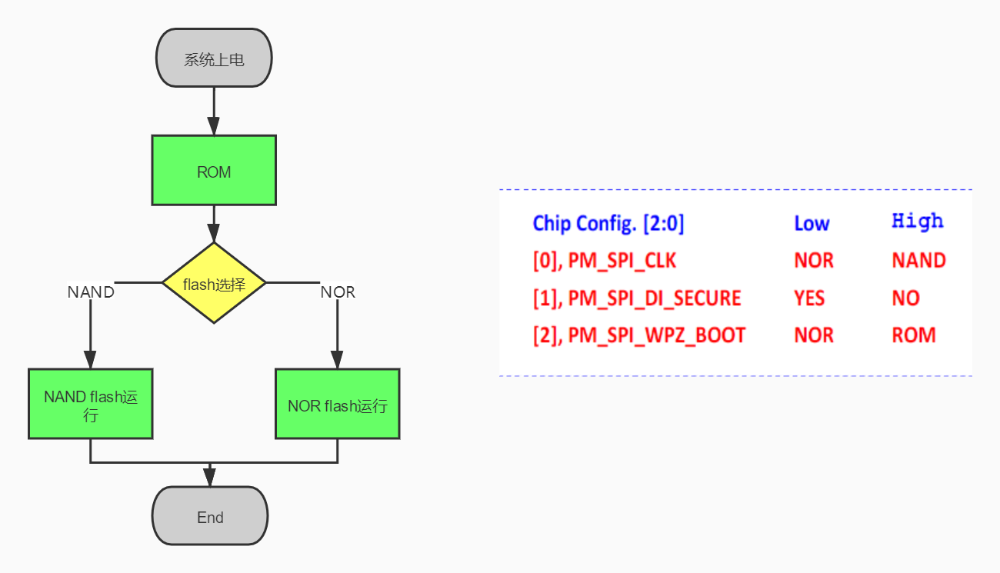
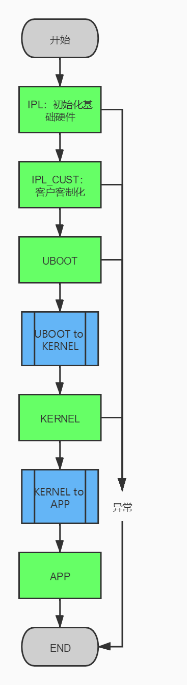
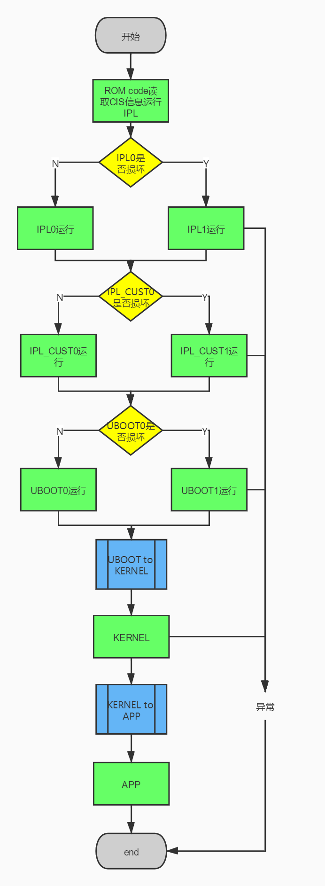

# SSD20X启动流程 
## 1、分区
### 1.1、启动方式
- SSD20x 只有两种启动方式 
   1. nand flash启动
   2. nor flash启动
### 1.2、NOR分区基本介绍
分区名 | 概要
---------|---------
 IPL | 主要功能是做一些基础的硬件初始化，例如设定当前DDR参数，以及GPIO/IIC相关等
 IPL_CUST | IPL_CUST中会根据当前板子的实际情况初始化客制化板子硬件的可执行的二进制文件，例如客制化的GPIO管教，IIC配置
 MXPT | 分区配置相关的二进制档案。
 UBOOT | UBOOT的二进制文件存放分区。
 UBOOT_ENV | UBOOT的环境变量存放分区
 LOGO | 在NVR设备上会使用，存放的是开机logo相关的配置
 KERNEL | 存放内核的二进制文件
 ROOTFS | 文件系统
 miservice | 对应板子上configs分区，这是公板定义的一个分区，它用来存储mi的库、一些配置文档，文件系统默认jiffs2。
 customer | 用户定制的分区
### 1.3、NAND分区基本介绍
分区名 | 概要
---------|---------
 CIS | SPI-NAND独有的分区，保存在flash 0地址的位置，它包含两部分内容，一部分是spinand info，保存spinand的一些基本信息，另一部分是partinifo，保存的分区信息，给ROM CODE使用的
 IPL0 | 主要功能是做一些基础的硬件初始化，例如设定当前DDR参数，以及GPIO/IIC相关等
 IPL1 | IPL0的备份分区
 IPL_CUST0 | IPL_CUST中会根据当前板子的实际情况初始化客制化板子硬件的可执行的二进制文件，例如客制化的GPIO管教，IIC配置
 IPL_CUST1 | IPL_CUST0的备份分区
 UBOOT0 | UBOOT的二进制文件存放分区。
 UBOOT0 | UBOOT1的备份分区
 ENV0 | UBOOT的环境变量存放分区
 ENV1 | ENV0的备份分区
 KEY_CUST | 存放第三方用户密钥
 LOGO | 在NVR设备上会使用，存放的是开机logo相关的配置
 KERNEL | 存放内核的二进制文件
 RECOVERY | KERNEL的备份分区。
 ROOTFS | 文件系统
 UBI | UBI的内容在上图分区表中不会显示出来，UBI中会创建多个ubifs格式的子分区，客户可以根据需要自行创建。Spinand的miservice分区就是放在UBI中
### 1.4启动方式选择流程
- Security boot启动流程会IPL等分区做安全性校验，这边不涉及（有特殊申请的客户才会开放该资料）。


### 1.5、NOR flash启动流程


### 1.6、NAND flash启动流程


## 2、系统
### 2.1 uboot启动流程
- 标准的uboot启动流程在网上均能看到如
   - 嵌入式Linux开发之uboot启动Linux整体流程分析 - ZhangyiStudio - 博客园 https://www.cnblogs.com/zhangyi-studio/p/8179795.html
- 这边只说明SSD20x上常用、特殊需要注意的启动流程。
- 其他说明：
   - uboot主函数程序如下`common/main.c`
   - 若需要添加自己下cli命令可参考 [uboot下添加自己的cli命令](../uboot_add_cmd/README.md)；
- 启动
   1. uboot启动时，按回车可进入到uboot cli命令行中。之后可使用uboot命令进行相应操作。
   2. 退出cli命令时，会读env的变量数值来判断是否需要进行升级（uboot的config需要开启对应配置）。
      - USB: setenv usbautoupgrade 1;saveenv
      - SD: setenv sdautoupgrade 1;saveenv
      - EMMC: setenv emmcautoupgrade 1;saveenv
   3. 之后会执行env变量中的`bootcmd`命令如公版` bootlogo 0 0 0 0 0; mw 1f001cc0 11; gpio out 8 0; nand read.e 0x22000000 KERNEL 0x500000; gpio out 8 1; bootm 0x22000000;nand read.e 0x22000000 RECOVERY 0x500000; bootm 0x22000000`
      - 会依次执行该命令。包括bootlogo的显示也是执行该命令后显示的，直到最后运行kernel

### 2.2 app启动流程
- 以zk DEMO为例。
- 启动：
    1. kernel起来后，会运行/etc/profile。依次执行以下部分（该文件可在project下对应脚本修改，增加自己的内容）
```shell
  1 #!/bin/sh
  2 export PATH=/bin:/sbin:/usr/bin:/usr/sbin
  3 export LD_LIBRARY_PATH=/lib
  4 mkdir -p /dev/pts
  5 ulimit -c unlimited
  6 export PATH=$PATH:/config
  7 export TERMINFO=/config/terminfo
  8 export LD_LIBRARY_PATH=$LD_LIBRARY_PATH:/config/lib
  9 mkdir -p /dev/pts
 10 mount -t sysfs none /sys
 11 mount -t tmpfs mdev /dev
 12 mount -t debugfs none /sys/kernel/debug/
 13 mdev -s
 14 mkdir -p /var/lock
 15 mount -t ubifs ubi0:miservice /config
 16  mount -t ubifs ubi0:customer /customer
 17  mount -t ubifs ubi0:appconfigs /appconfigs
 18  mount -t ubifs ubi0:test1 /test1
 19 
 20 mkdir -p /dev/pts
 21 mount -t devpts devpts /dev/pts
 22 busybox telnetd&
 23 if [ -e /etc/core.sh ]; then
 24     echo "|/etc/core.sh %p" > /proc/sys/kernel/core_pattern
 25 chmod 777 /etc/core.sh
 26 fi;
 27 if [ -e /customer/demo.sh ]; then
 28     /customer/demo.sh
 29 fi;

```
   2.在最后会判断是否存在`/customer/demo.sh`文件，存在的话就执行改脚本。
   - 该脚本在project打包时会自动生成。
   - 会加载相关ko，配置对应环境最后启动zk DEMO
