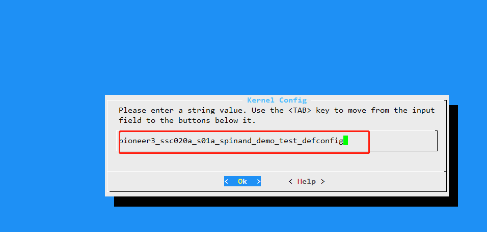

# 背景
- SSD2x2的架构，在project打包时，会自动编译kernel，并将编译好的kernel拷贝到project下
- 此时，如果按SSD20x的方式（在kernel 下执行 make menuconfig）修改kernel 的config配置，则在打包project时又会把kernel的配置设置为默认
- 此时需要自己保存自己的config即可
# 操作方式如下
### 在kernel 文件夹操作
1. 在kernel下执行`make menuconfig` 后修改自己想要配置
2. 修改完成后执行`make savedefconfig`来保存自己的配置
3. 将保存好的配置拷贝到指定路径如`mv defconfig ./arch/arm/configs/pioneer3_ssc020a_s01a_spinand_demo_test_defconfig` **必须要defconfig结尾**
### project 文件夹操作
1. `make dispcam_p3_spinand.glibc-9.1.0-s01a.64.qfn128.demo_defconfig`执行好自己想要编译的默认配置后
2. `make menuconfig`找到kernel->Kernel Config修改成刚才在kernel下保存的自己配置

3. 保存退出后，正常执行`make image`即可